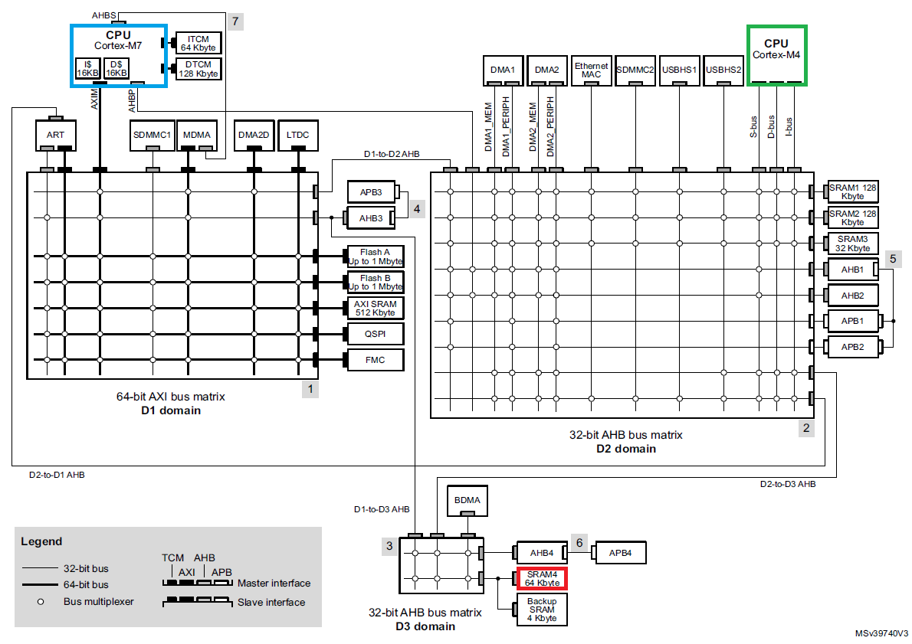
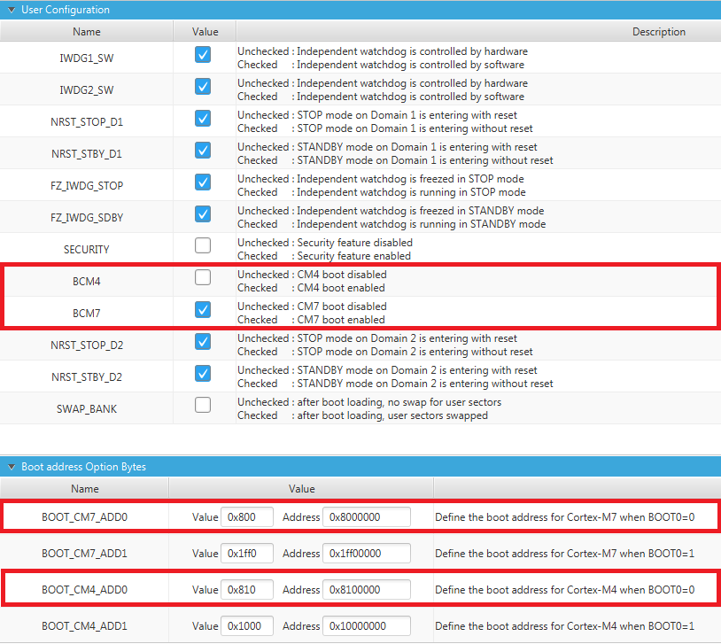

# STM32H7 dual-core inter-CPU communication

Example project for inter-processor communication between 2 cores, ARM Cortex-M7 and ARM-Cortex-M4 cores.

## How it works

This example demonstrates how to implement communication between both cores to exchange data.
It uses shared RAM and `2` separate ring buffers, acting like pipe (single input, single output)
in both direction. First buffer from CPU1 to CPU2, second buffer from CPU2 to CPU1.

SRAM4 is used as shared RAM in D3 domain. This RAM is preferred and suggested to be used for shared RAM
in dual-core STM32H7xx series for inter-CPU communication. It is outside both domains of both CPU cores,
not affecting to low-power features of each domain.

## Used hardware

Example runs on official ST Nucleo boards for dual-core STM32H7 series, listed below.

* [Nucleo-H745ZI-Q](https://www.st.com/en/evaluation-tools/nucleo-h745zi-q.html)
* [Nucleo-H755ZI-Q](https://www.st.com/en/evaluation-tools/nucleo-h755zi-q.html)

## STM32H7 option bytes configuration

STM32H7 dual-core CPU must have some option bytes configured to run the example properly.
Example is configured for this configuration:

* CPU1 (Cortex-M7) flash memory address is `0x08000000` and its size is `1MB`
* CPU2 (Cortex-M4) flash memory address is `0x08100000` and its size is `1MB`
* CPU1 boot option must be enabled to ensure Cortex-M7 starts after reset
* CPU2 boot can be enabled or disabled. CPU1 always starts CPU2 by software, regardless of CPU2 boot configuration

> Option bytes can be configured using [STM32CubeProgrammer](https://www.st.com/en/development-tools/stm32cubeprog.html) software

## Run examples

Run examples with [STM32CubeIDE v1.3.0](https://www.st.com/en/development-tools/stm32cubeide.html) or later toolchain.
